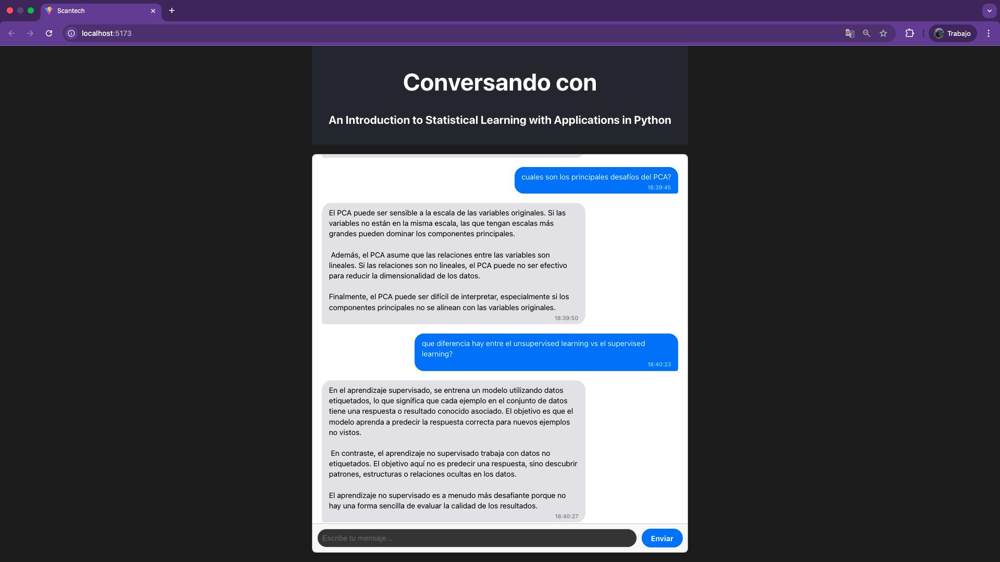

# Scantech Challenge: Agente RAG con Pinecone y Gemini 🤖

Este proyecto se presenta en el marco del challenge para la empresa Scanntech.
Es una un chatbot basado en **RAG** puede responder preguntas de un usuario basandose en el libro An Introduction to Statistical Learning with Applications in Python. 
Para el agente se utilizó el modelo **gemini-2.0-flash** que ofrece Google.
Para el proceso de RAG se utilizó el libro brindado, se vectorizó utilizando el modelo **text-embedding-3-small** que ofrece OpenAI.
Para el almacenamiento persistente de los vectores, se utilizó **Pinecone** como proveedor.

##  Preview



## Índice

- [Features](#features)
- [Stack Tecnológico](#stack-tecnológico)
- [Estructura del Proyecto](#estructura-del-proyecto)
- [Prerrequisitos](#prerrequisitos)
- [Instalación y Ejecución Local](#instalación-y-ejecución-local)
- [Variables de Entorno](#variables-de-entorno)
- [Despliegue en Railway](#despliegue-en-railway)

## Features

- **Interfaz de Chat en Tiempo Real**: Construida con React para una experiencia de usuario fluida e instantánea.
- **Memoria de Conversación**: El chatbot recuerda el historial del chat para mantener el contexto en las conversaciones largas.
- **Búsqueda Semántica (RAG)**: En lugar de depender solo de su conocimiento interno, el agente utiliza una herramienta personalizada para buscar información relevante en una base de datos vectorial (Pinecone), proporcionando respuestas precisas y basadas en el contenido del libro.
- **Componentes de UI Pulidos**: La interfaz incluye timestamps en los mensajes, manejo de estados de carga y un diseño responsivo.

## Stack Tecnológico

- **Frontend**:
  - **Librería**: React
  - **Bundler**: Vite
  - **Estilos**: CSS puro

- **Backend**:
  - **Framework**: Python, Flask
  - **Servidor WSGI**: Gunicorn (para producción)

- **IA y Base de Datos**:
  - **Modelo de Lenguaje**: Google Gemini
  - **Base de Datos Vectorial**: Pinecone
  - **Modelo de Embeddings**: OpenAI

- **Despliegue**:
  - **Plataforma**: Railway

## Estructura del Proyecto

El proyecto está organizado como un monorepo con dos directorios principales:

```
/
├── backend/       # Código del servidor Flask (API y lógica del agente)
│   ├── data/
│   │   ├── PDF-GenAI-Challenge.pdf     # Documento provisto por Scantech
│   ├── src/
│   │   ├── app/
│   │   ├── services/
│   │   │   ├── vectorize_pdf.py     # Script para vectorizar el documento
│   ├── main.py
│   ├── requirements.txt
├── frontend/       # Código de la aplicación de chat en React
│   ├── public/
│   ├── src/
│   │   ├── api/
│   │   ├── assets/
│   │   ├── components/     # Componentes y estilos del front
│   │   ├── App.css
│   │   ├── App.jsx
│   │   ├── index.css
│   │   ├── main.jsx
│   ├── package.json
│   └── ...
├── media/    # Imagenes para el README.md
└── README.md
```

## Prerrequisitos

Antes de comenzar, asegúrate de tener instalado lo siguiente:
- [Node.js](https://nodejs.org/en/) (versión 18 o superior)
- [Python](https://www.python.org/downloads/) (versión 3.9 o superior)
- [Git](https://git-scm.com/)

## Instalación y Ejecución Local

Sigue estos pasos para configurar y ejecutar el proyecto en tu máquina local.

### 1. Clonar el Repositorio

```bash
git clone git@github.com:pablojrosa/scanntech_challenge.git
cd scanntech_challenge
```

### 2. Configurar el Backend

```bash
# 1. Navega a la carpeta del backend
cd backend

# 2. Crea y activa un entorno virtual
python -m venv venv
source venv/bin/activate  # En Windows: venv\Scripts\activate

# 3. Instala las dependencias de Python
pip install -r requirements.txt

# 4. Crea un archivo .env y añade tus claves (ver sección "Variables de Entorno")
cp .env.example .env
# Edita el archivo .env con tus claves
```

### 3. Configurar el Frontend

```bash
# 1. Desde la raíz, navega a la carpeta del frontend
cd frontend

# 2. Instala las dependencias de Node.js
npm install
```

### 4. Ejecutar la Aplicación

Debes tener dos terminales abiertas simultáneamente.

- **Terminal 1 (Backend)**:
  ```bash
  cd backend
  source venv/bin/activate
  flask run --port 5001
  ```
  El servidor de backend estará corriendo en `http://localhost:5001`.

- **Terminal 2 (Frontend)**:
  ```bash
  cd frontend
  npm run dev
  ```
  La aplicación de React estará disponible en `http://localhost:5173` (o el puerto que indique Vite).

## Variables de Entorno

Para que el backend funcione, necesitas un archivo `.env` en la carpeta `backend/` con las siguientes variables. Crea una copia de `.env.example` si existe, o crea el archivo desde cero.

```ini
# Clave de API de Google para el modelo Gemini
GOOGLE_API_KEY="tu_clave_de_google"

# Claves de API para Pinecone
PINECONE_API_KEY="tu_clave_de_pinecone"
PINECONE_INDEX_NAME="nombre-de-tu-indice"

# Claves de API para OpenAI (usado para generar los embeddings)
OPENAI_API_KEY="tu_clave_de_openai"
EMBEDDING_MODEL="text-embedding-3-small"
```