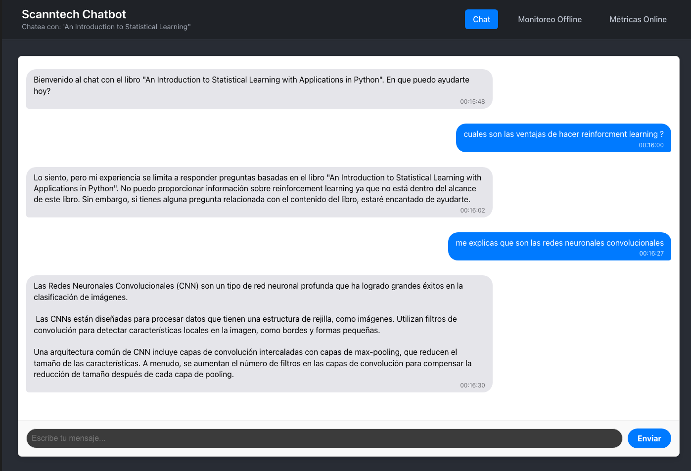

# Scanntech Challenge
# Panel de Control RAG con Gemini y Métricas de Calidad 🚀

Este proyecto fue desarrollado en el marco de un desafío técnico propuesto por Scanntech. Es un sistema que principalmente está compuesto por un chatbot basado en **RAG** (Retrieval-Augmented Generation) que responde preguntas sobre el libro "An Introduction to Statistical Learning with Applications in Python".

Además de ser un simple chatbot, este proyecto implementa un **Panel de Control** que permite monitorear, evaluar y mejorar la calidad del sistema RAG a través de métricas en tiempo real y evaluaciones exhaustivas bajo demanda.

## Preview

 

## Índice

- [Panel de Control RAG: Features Principales](#panel-de-control-rag-features-principales)
- [Sistema de Evaluación Dual](#sistema-de-evaluación-dual)
- [Stack Tecnológico](#stack-tecnológico)
- [Estructura del Proyecto](#estructura-del-proyecto)
- [Despliegue en Railway con Docker](#despliegue-en-railway-con-docker)

## Panel de Control RAG: Features Principales

La aplicación se presenta como un panel de control con tres secciones principales, diseñadas para interactuar con el agente y analizar su rendimiento.

### 1. Chat Interactivo
Una interfaz de chat construida con React que permite a los usuarios conversar con el agente. Incluye:
- **Memoria de Conversación**: El historial del chat se envía al agente para mantener el contexto.
- **Búsqueda Semántica**: El agente utiliza Pinecone para buscar en el libro y basar sus respuestas en la información recuperada.
- **Persistencia de Conversaciones**: Todos los mensajes (usuario y agente) se almacenan en una base de datos PostgreSQL.

### 2. Métricas de Conversación (Métricas Online)
Una vista de tabla que muestra las métricas de calidad de las conversaciones reales de los usuarios, calculadas en tiempo real.
- **Evaluación Automática**: Cada respuesta del bot se evalúa en segundo plano para no afectar la experiencia del usuario.
- **Métricas Clave**: Se miden `faithfulness` (fidelidad, para detectar alucinaciones) y `answer_relevancy` (relevancia de la respuesta).
- **Contexto Completo**: La tabla muestra la pregunta del usuario, la respuesta del bot y sus respectivos scores, permitiendo un diagnóstico rápido de problemas.

### 3. Evaluación del Sistema (Monitoreo Offline)
Una sección dedicada a ejecutar una evaluación profunda y controlada del sistema RAG.
- **Golden Dataset**: Utiliza un conjunto de datos curado de preguntas y respuestas "correctas" almacenado en PostgreSQL.
- **Ejecución "Offline"**: Una interfaz donde se  un script que corre todo el dataset de evaluación contra el sistema RAG.
- **Reporte Completo**: Muestra un reporte detallado con métricas avanzadas como `context_precision`, `context_recall` y `answer_correctness`, permitiendo validar objetivamente la calidad de los componentes de retrieval y generación.

## Sistema de Evaluación Dual

El corazón de este proyecto es su enfoque no solo en brindar una interfaz para conversar, sino en la posibilidad de evaluar las respuestas utilizando la librería **Ragas** para implementar dos bucles de evaluación complementarios:

- **Métricas Online:** Proporciona una visión constante de la performance del bot en producción, detectando problemas en conversaciones reales a través de métricas sin referencia.
- **Monitoreo Offline:** Permite a los desarrolladores medir la calidad del sistema en un entorno controlado, comparar versiones de prompts y validar mejoras de forma científica antes de desplegarlas.

## Stack Tecnológico

- **Frontend**:
  - **Librería/Framework**: React, Vite
  - **Estilos**: CSS puro

- **Backend**:
  - **Framework**: Python, Flask
  - **Base de Datos Relacional**: PostgreSQL
  - **ORM y Migraciones**: SQLAlchemy, Flask-Migrate
  - **Servidor WSGI**: Gunicorn

- **IA**:
  - **Modelo de Lenguaje**: Google Gemini (`gemini-2.0-flash`)
  - **Base de Datos Vectorial**: Pinecone
  - **Modelo de Embeddings**: OpenAI (`text-embedding-3-small`)
  - **Librería de Evaluación RAG**: Ragas

- **Despliegue**:
  - **Plataforma**: Railway
  - **Contenerización**: **Docker**

## Estructura del Proyecto

El proyecto está organizado como un monorepo con dos directorios principales:

```
/
├── backend/                       # Código del servidor Flask
│   ├── data/                      # Libro en .pdf
│   ├── src/
│   │   ├── app/                   # Lógica de la aplicación, modelos y herramientas
│   │   └── services/              # Se encuentra alojado el vectorize_pdf.py
│   ├── migrations/                # Scripts de migración de la base de datos
│   ├── Dockerfile                 # Define el entorno de producción con Docker
│   ├── .dockerignore              # Excluye archivos innecesarios de la imagen Docker
│   ├── main.py                    # Punto de entrada de la aplicación Flask
│   ├── run_evaluations.py         # Script para la evaluación offline
│   ├── create_golden_dataset.py   # Script para crear el golden dataset
│   └── requirements.txt
│
├── frontend/                      # Código de la aplicación de React
│   ├── src/
│   │   ├── api/                   # Funciones para llamar al backend
│   │   ├── components/            # Componentes, páginas y estilos
│   │   ├── App.jsx                # Orquestador de rutas
│   │   └── main.jsx               # Punto de entrada de la aplicación React
│   └── ...
├── media/                         # Archivos complementarios
├── .gitignore
└── README.md
```

## Despliegue en Railway con Docker

Este proyecto está diseñado para ser desplegado de forma robusta y consistente en la plataforma **Railway** utilizando **Docker**. La contenerización asegura que el entorno de ejecución sea idéntico sin importar dónde se despliegue, eliminando problemas de dependencias de sistema (como la necesidad de `git` para la librería `ragas`).

### Configuración en Railway

1.  **Crear el Proyecto**: Sube tu repositorio a GitHub y crea un nuevo proyecto en Railway a partir de él.
2.  **Añadir Base de Datos**: Dentro del proyecto de Railway, añade un nuevo servicio de base de datos **PostgreSQL**. Railway inyectará automáticamente la variable de entorno `DATABASE_URL` en tus otros servicios.
3.  **Configurar Variables de Entorno**: En el servicio `backend`, ve a la pestaña "Variables" y configura las siguientes claves secretas:

    ```ini
    # Clave de API de Google para el modelo Gemini
    GOOGLE_API_KEY="tu_clave_de_google"

    # Claves de API para Pinecone
    PINECONE_API_KEY="tu_clave_de_pinecone"

    # Clave de API para OpenAI (usado para los embeddings)
    OPENAI_API_KEY="tu_clave_de_openai"
    
    # Orígenes permitidos para CORS (la URL de tu frontend desplegado)
    ALLOWED_ORIGINS="https://tu-frontend.up.railway.app" 
    ```

4.  **Configurar Directorio Raíz (¡Importante!)**: Como este es un monorepo, debes indicarle a Railway dónde encontrar el backend. En los `Settings` del servicio `backend`, en la sección `Build`, establece el **Root Directory** en `backend/`.

5.  **Desplegar**: ¡Y listo! Con las variables y el directorio raíz configurados, cualquier `git push` a tu rama principal disparará un nuevo despliegue. Railway detectará automáticamente el `Dockerfile` dentro de `backend/`, construirá la imagen, y la pondrá en línea. El comando `CMD` dentro del `Dockerfile` se encarga de aplicar las migraciones (`flask db upgrade`) y luego iniciar el servidor (`gunicorn main:app`).